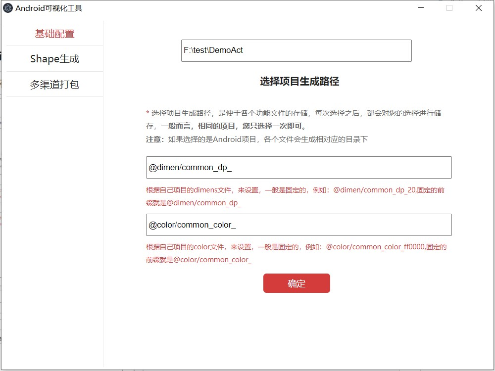

# AndroidShortcutTools

AndroidShortcutTools是一个专注于Android端代码自动生成的可视化工具，通过可视化工具，可以快速的帮助我们实现项目创建，模块创建，页面创建，资源创建等功能，非常的方便，目前有序的开发中。

## 最近更新
```
时间：2022年5月26日
更新内容：新增对象生成
```

## 目录说明

####  1、code

```
code下存放所有功能的源码，大家只关注这个目录下即可。

```

####  2、image

```
image存放的是可视化脚手架的效果图。

```

####  3、node安装包
```
因为可视化工具，需要node环境，目前存放了windows下安装包，如果你是mac或其他系统的话，请访问官网进行下载：

https://nodejs.org

```

#### 4、教程地址

公众号第一时间发布，其他平台略有延迟，还请各位老铁，多多关注公众号。

#### 5、注意事项

源码中没包含node编译后的文件，也就是node_modules目录，太大了上传不上去，大家按照第二章环境搭建那天的课程，一步一步的执行，自己来生成node_modules，其他的都可以参考源码。


#### 6、截至第五章内容的效果展示

|  基础配置页  |  Shape生成页  |
|  ----  |  ----  |
|    |    |
|  多渠道打包  |  对象生成  |
|  ----  |  ----  |
|    |    |


## 欢迎关注作者

微信搜索【Android干货铺】，或扫描下面二维码关注，查阅更多技术文章！


## License

```
Copyright (C) AbnerMing, AndroidShortcutTools Open Source Project

Licensed under the Apache License, Version 2.0 (the "License");
you may not use this file except in compliance with the License.
You may obtain a copy of the License at

     http://www.apache.org/licenses/LICENSE-2.0

Unless required by applicable law or agreed to in writing, software
distributed under the License is distributed on an "AS IS" BASIS,
WITHOUT WARRANTIES OR CONDITIONS OF ANY KIND, either express or implied.
See the License for the specific language governing permissions and
limitations under the License.
```


